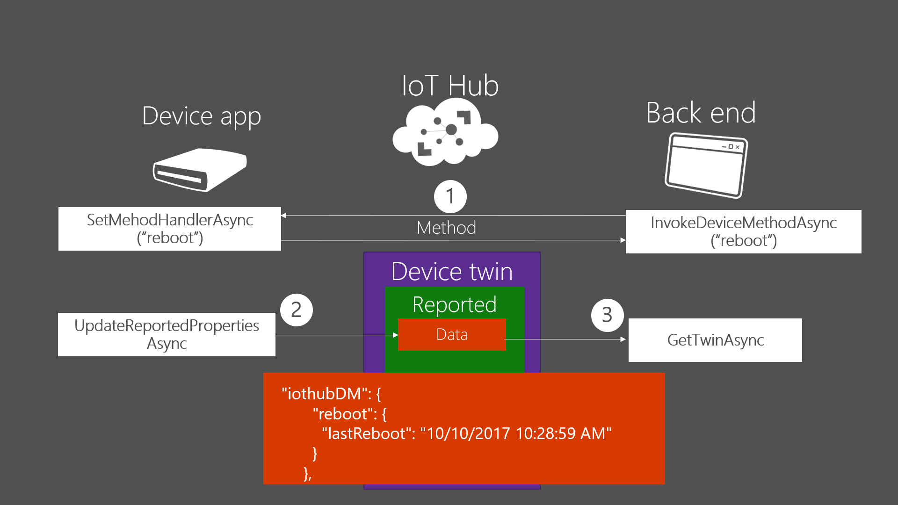
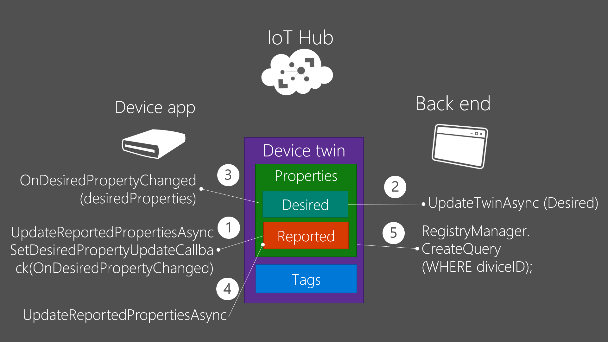
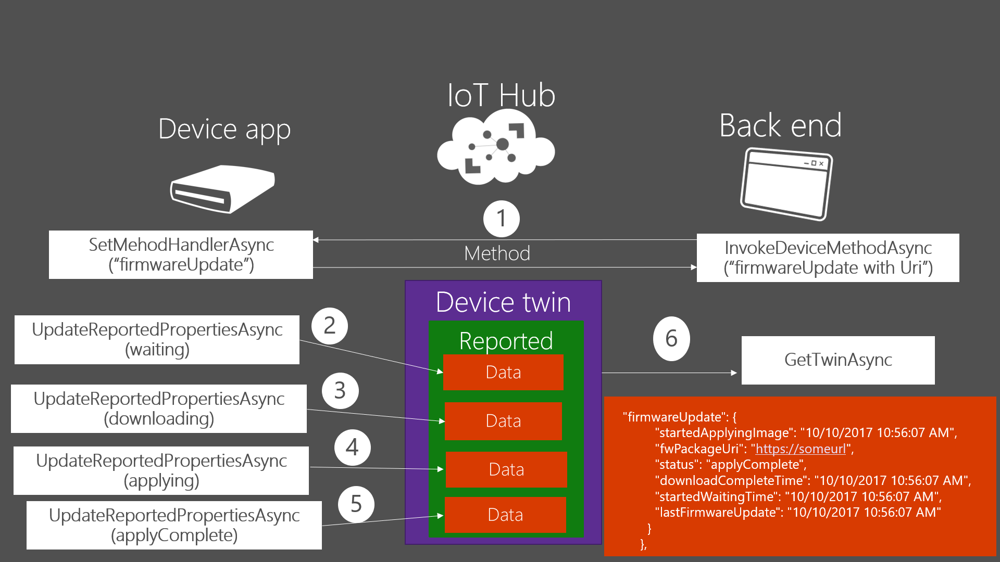

# Azure Device Twins Sample source 
Sometime, examining the source code is more efficient, straightforward than reading docs to understand how it works. This example helps you to understand how Azure Twin works with Azure Device management APIs. 

If you need more specific information, visit the MS Doc site https://docs.microsoft.com/en-us/azure/iot-hub/iot-hub-csharp-csharp-twin-getstarted. Please note that I wrote this code before MS release .NET back end .NET device source. Therefore, the source is little bit different from the docs site but similar.
 
Below’s APIs are particular new APIs for Device Twins management. It might be helpful to look over those APIs descriptions before you compile and implement samples.  

### Device side 
  
    DeviceClient. UpdatedReportedPropertiesAsync
 
    DeviceClient. SetMethodHandlerAsync(MethodCallback) 

    DeviceClient. SetDesiredPropertyUpdateCallback(DesiredPropertyUpdateCallback)

### Back end side 
    RegistryManager. CreateQuery
 
    RegistryManager. UpdateTwinAsync
 
    RegistryManager. GetTwinAsync
 
    ServiceClient. InvokeDeviceMethodAsync 

## What is Device Twins? 
Device twins are JSON documents that store device state information (metadata, configurations, and conditions). IoT Hub persists a device twin for each device that you connect to IoT Hub. Device twin’s JSON documents have tags, desired and reported properties. 

If you finish all the sample, your device’s device twin JSON doc would look like below ( skipped all metadata ) 

    {
    "deviceId": "test4",
    "etag": "AAAAAAAAAAU=",
    "version": 48,
    "tags": {
    "location": {
      "region": "US",
      "plant": "Redmond43"
    }
    },
    "properties": {
    "desired": {
      "$metadata": {
        "$lastUpdated": "2017-06-16T16:33:28.8922274Z"
      },
      "$version": 1
    },
    "reported": {
      "connectivity": {
        "type": "cellular"
      },
      "iothubDM": {
        "reboot": {
          "lastReboot": "6/19/2017 4:02:05 PM"
        },
        "firmwareUpdate": {
          "startedWaitingTime": "6/20/2017 3:15:11 AM",
          "fwPackageUri": "https://someurl",
          "status": "applyComplete",
          "downloadCompleteTime": "6/20/2017 3:15:11 AM",
          "startedApplyingImage": "6/20/2017 3:15:11 AM",
          "lastFirmwareUpdate": "6/20/2017 3:15:11 AM"
        }
      },      
      "$version": 43
    }
    }
    }

## 1.TwinsTagProperties
ReportConnectivity ( Device app ) : update reported “connectivity”property 
 
    "reported": {
      "connectivity": {
        "type": "cellular"
      },

AddtagsAndQuery (Back end ) : update twins tags and read the changed reported property 

    "tags": {
    "location": {
      "region": "US",
      "plant": "Redmond43"
      }
    },

 

## 2.DirectMethod 
DirectMethodDevice ( Device app ) : register method handler by using SetMethodHandlerAsync 

CallMethodOnDevice ( Back end ) : invoke a method by using InvokeDeviceMethodAsync 

Those app don’t affect Device Twins properties. 

 

## 3.DeviceManagement  
DirectMethodDevice ( Device app ) : register and implement method handler “reboot”. After that, update Device twins reported property 

    “reported”: {
    "iothubDM": {
        "reboot": {
          "lastReboot": "10/10/2017 10:28:59 AM"
        }
      },
 
TriggerReboot ( Back end ) : invoke the “reboot” method, and get reported property. 
 

 

## 4.TwinProperties   

SimulateDevice ( Device app ) : update reported property and register callback function corresponding to Device Twins Desired property change

    “reported”: {
     "telemetryConfig": {
        "configId": "0",
        "sendFrequency": "24h"
      },
      
Invoke the corresponding callback function if Desired property changed 

Update Reported property after callback function invocation 

    "reported" {
     "telemetryConfig: {
      "configId": "7af4c91d-5c8b-450b-b8a3-6929001d0849",
      "sendFrequency": "5m",
      "status": "Success"
    }

DesiredConfiguration ( Back end ) : update Device Twins Desired property and get changed reported property 

    "desired": {
      "telemetryConfig": {
        "configId": "7af4c91d-5c8b-450b-b8a3-6929001d0849",
        "sendFrequency": "5m"
      },
 
 

## 5.Update  

DirectMethodDevice ( Device app ) : invoke the registered method handler and update Device Twins reported property waiting, downloading, applying and applyComplete respectively. 

    “reported”: {
    "firmwareUpdate": {
          "startedApplyingImage": "10/10/2017 10:56:07 AM",
          "fwPackageUri": "https://someurl",
          "status": "applyComplete",
          "downloadCompleteTime": "10/10/2017 10:56:07 AM",
          "startedWaitingTime": "10/10/2017 10:56:07 AM",
          "lastFirmwareUpdate": "10/10/2017 10:56:07 AM"
        }
      },

TriggerFWUpdate ( Back end ) : invoke the firmwareUpdate method and get device reported property 

 
